# Git Rewriter

A desktop GUI for safely rewriting Git history metadata -- author identity, timestamps, timezones, and commit messages. Built with Tauri v2 (Rust backend, React/TypeScript frontend).

## Features

- **Commit Explorer** -- browse commits, paginate, search by SHA/message/author, inspect details
- **Identity Rewrite** -- edit author/committer name and email on individual commits or batch-rewrite across the entire history from the Contributors page
- **Timestamp Editing** -- separate date, time, and timezone fields with permissive timezone input normalization (accepts `+0000`, `-0300`, `0000`, `05:30`, `-5`, etc.)
- **Message Editing** -- rewrite commit messages
- **Staging Workflow** -- stage changes per-commit, review them in the Preview page, then apply all at once
- **Identity Merge Suggestions** -- detect duplicate authors (e.g. `John Doe <john@old.com>` and `J. Doe <john@new.com>`) and merge them with a single click
- **Repository Management** -- open/switch repos, recent repos list with localStorage persistence, refresh scan

## Tech Stack

- **Frontend:** React, TypeScript, Tailwind CSS, Vite, Zustand
- **Backend:** Rust, Tauri v2
- **Git Engine:** gix (gitoxide) -- no external git CLI processes

## Screenshots

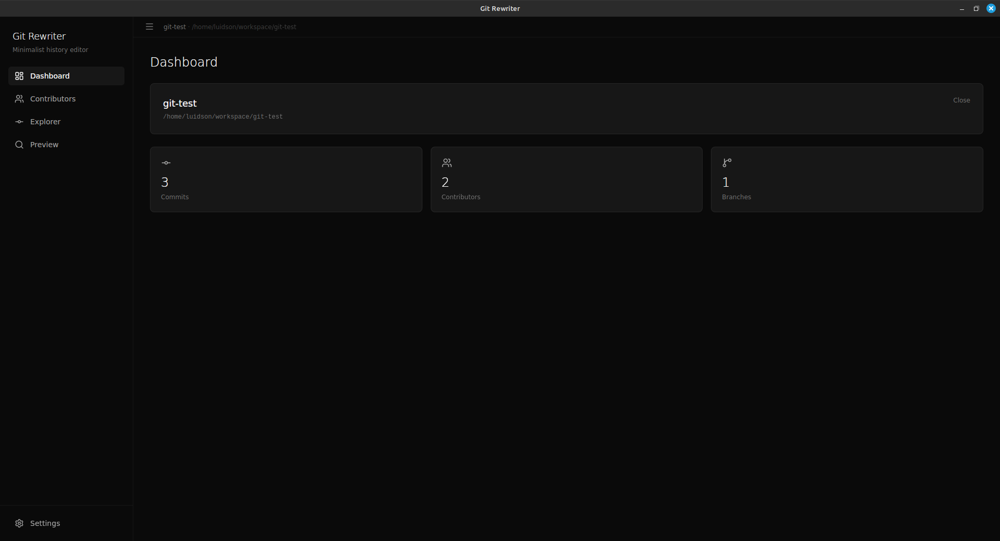
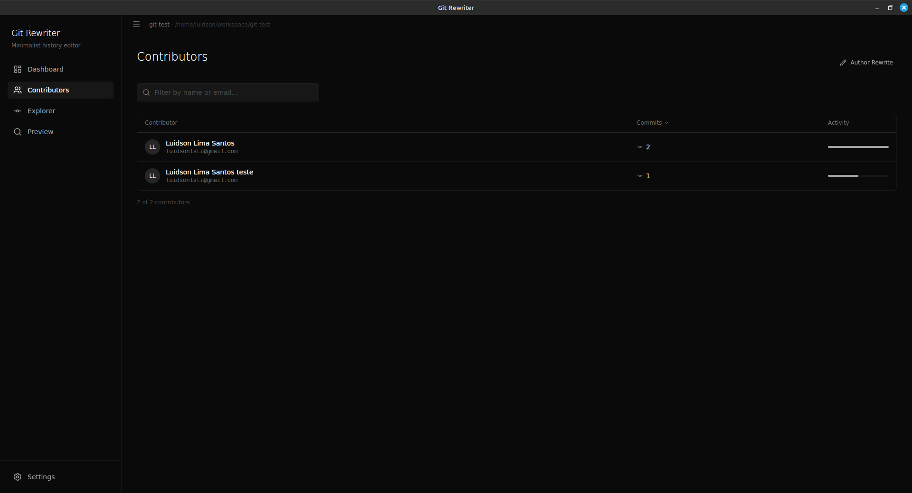
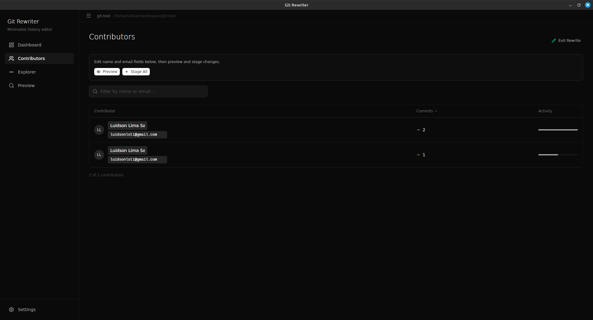
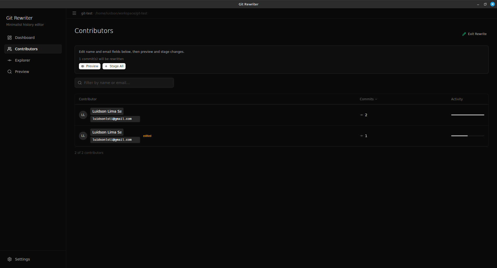
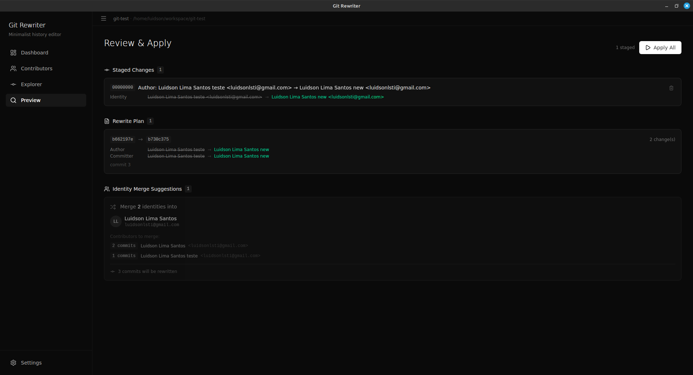
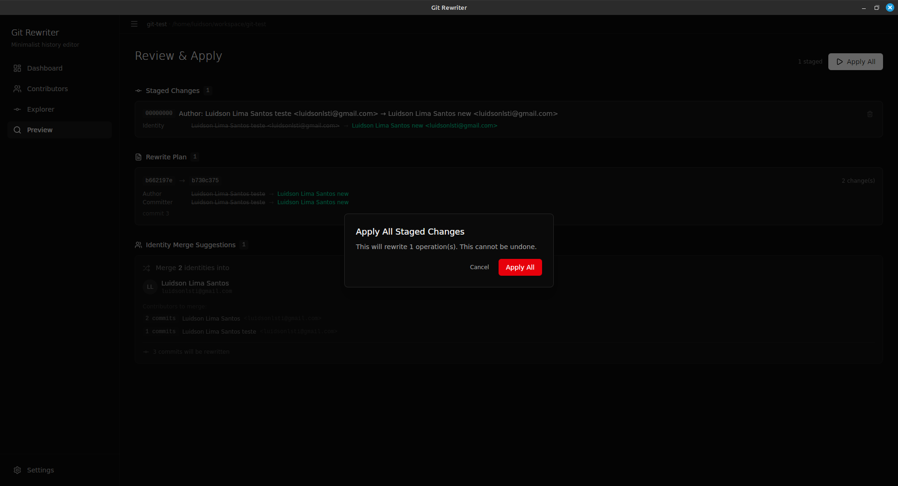
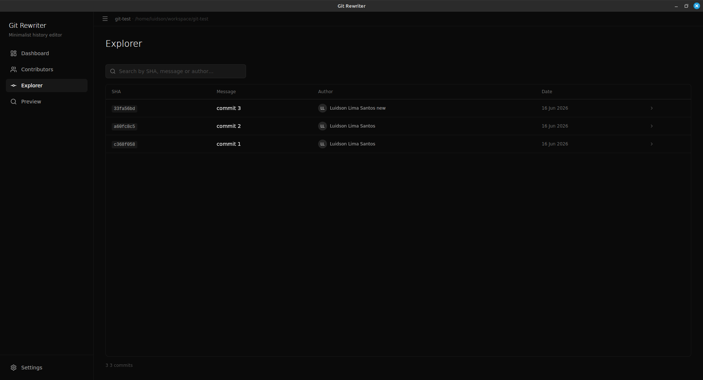
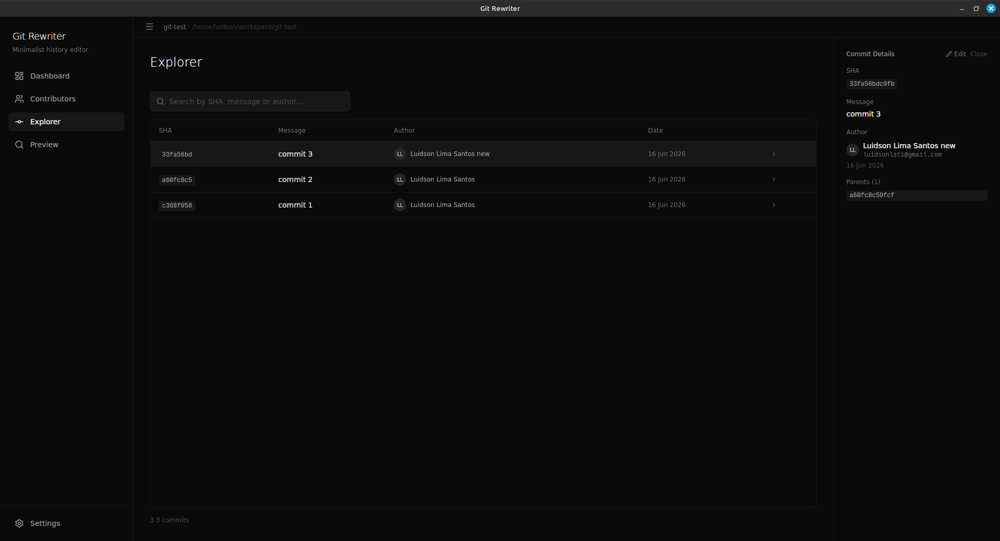
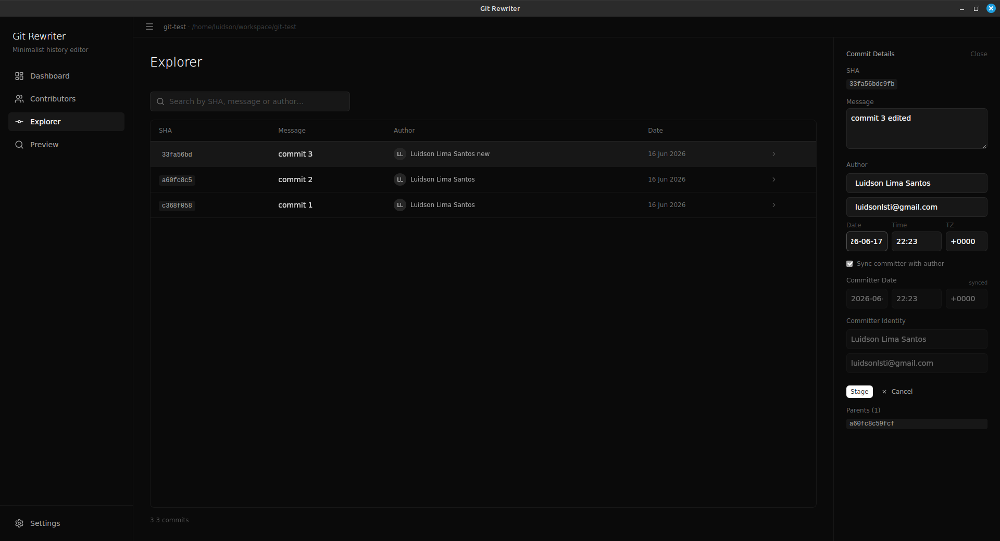
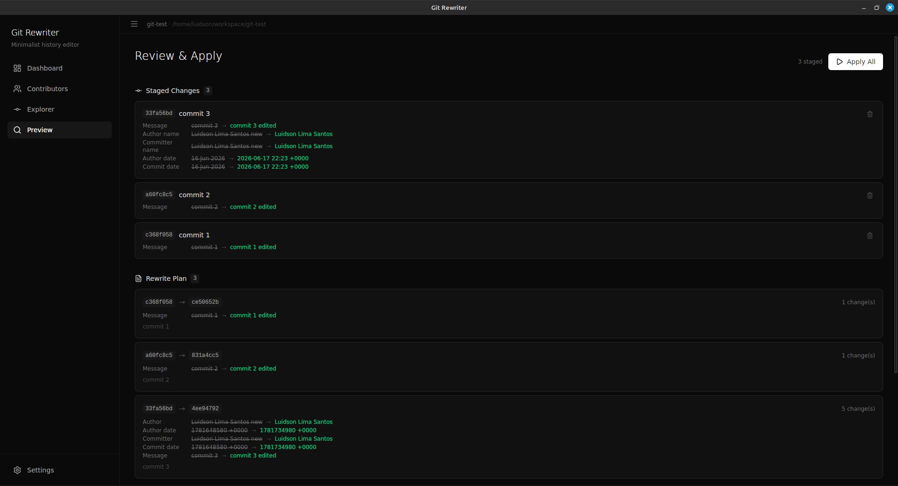
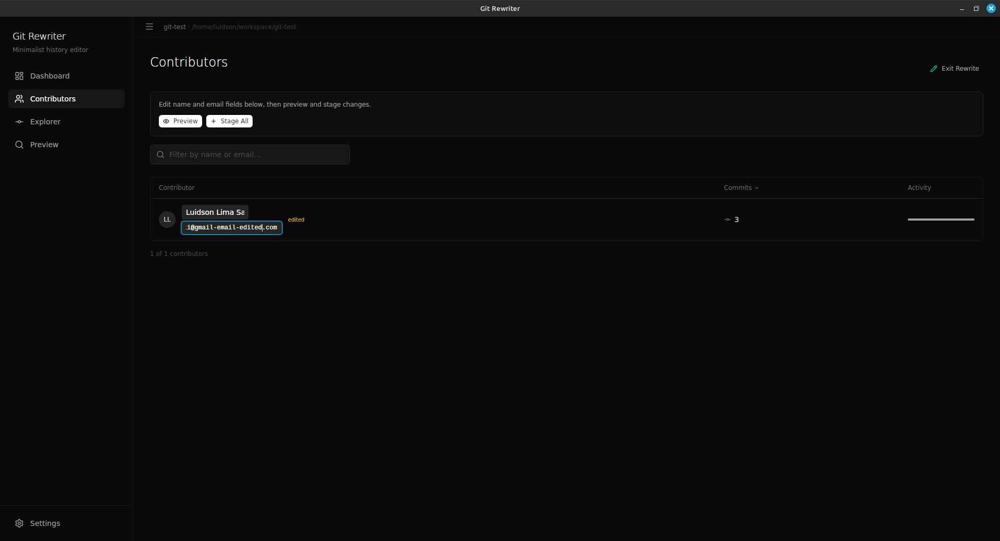
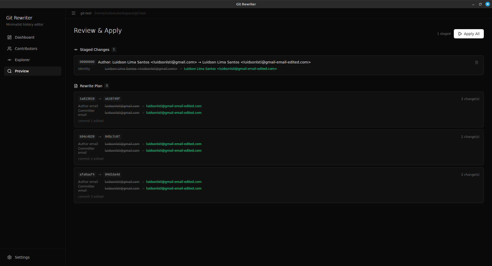
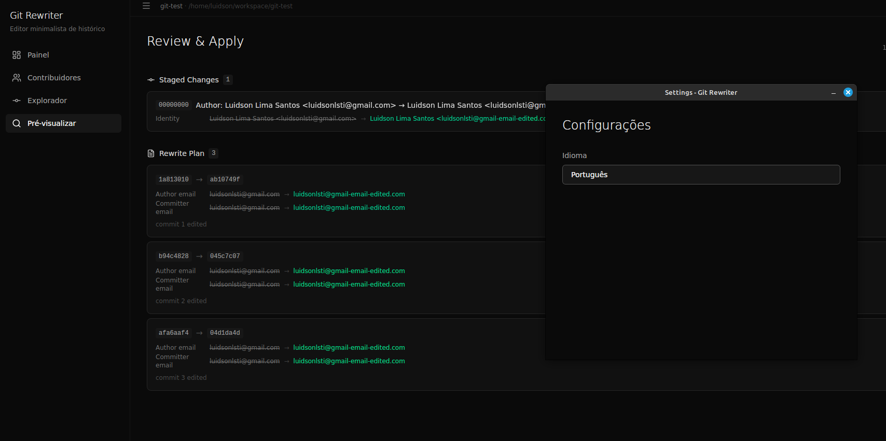

## Architecture

The frontend follows Atomic Design (`atoms`, `molecules`, `organisms`, `templates`, `pages`). All git operations that mutate history create new SHAs (commits are immutable). Changes are staged in a local store first, then applied in batch from the Preview page.

## Development

```bash
# Install dependencies
npm install

# Run in development mode (with hot-reload)
npm run tauri dev

# Run Rust tests
npm run tauri -- test -- --test-threads=1

# Build for production
npm run tauri build
```

## License

MIT
